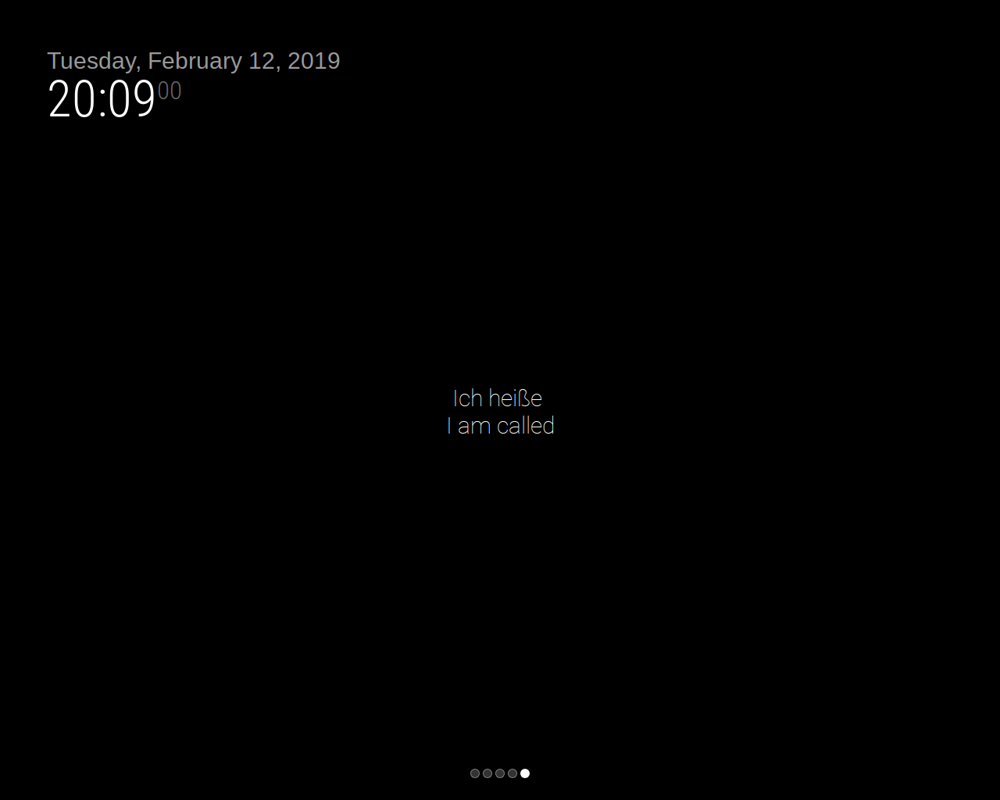

# Module: Year 8 German
The Year 8 German module is one of the modules created for Year 8 students, which randomly displays a German phrase and the English translation. 

## Screenshots
- Year 8 German Screenshot


## Using the module

To use this module, add it to the modules array in the `config/config.js` file:
````javascript
modules: [
	{
		module: "year8_german",
		position: "middle",	// This can be any of the regions.
									// 
		}
	}
]
````

## Configuration options

The following properties can be configured:


| Option           | Description
| ---------------- | -----------
| `updateInterval` | How often does the phrase have to change? (Milliseconds) <br><br> **Possible values:** `1000` - `86400000` <br> **Default value:** `30000` (30 seconds)
| `fadeSpeed`      | Speed of the update animation. (Milliseconds) <br><br> **Possible values:**`0` - `5000` <br> **Default value:** `4000` (4 seconds)
| `classes`        | Override the CSS classes of the div showing the phrases <br><br> **Default value:** `thin xlarge bright`


````

